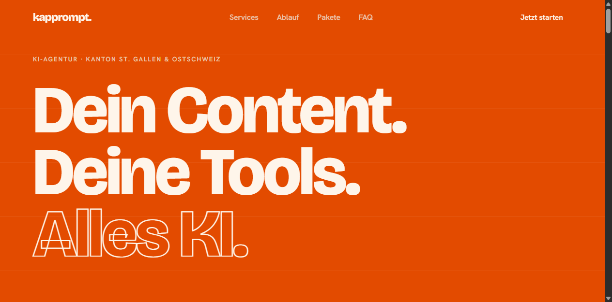
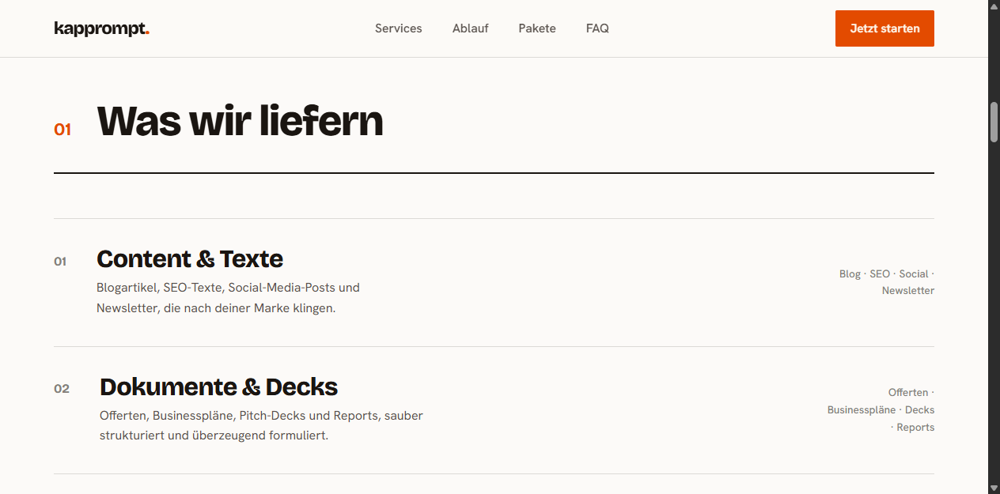
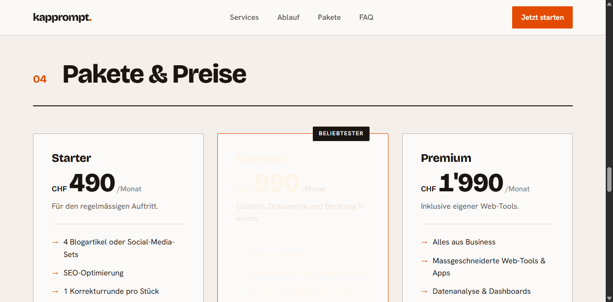

<div align="center">

# kapprompt.

**KI-gestützte Agentur für Schweizer KMU.**
Content, Dokumente und Web-Tools – in 2 bis 5 Tagen, zum Bruchteil der Agenturkosten.
Die KI liefert das Tempo, ein Mensch die Qualität.

[](https://kapprompt.ch)


<br/>



</div>

<br/>

## Worum geht's?

Die Marketing-Website von **kapprompt.** – einer KI-Agentur aus dem Kanton St. Gallen / Ostschweiz. Sie erstellt für kleine und mittlere Unternehmen Inhalte, Dokumente und massgeschneiderte Web-Tools: schnell, bezahlbar und in der Qualität von Hand geprüft.

## Was die Agentur liefert

<div align="center">



</div>

- **Content & Texte** – Blogartikel, SEO-Texte, Social-Media-Posts und Newsletter
- **Dokumente & Decks** – Offerten, Businesspläne, Pitch-Decks und Reports
- **Web-Tools & Apps** – massgeschneiderte Tools, Datenanalyse und Dashboards

## Pakete

<div align="center">



</div>

Drei Stufen vom regelmässigen Auftritt (Starter) bis zu eigenen Web-Tools (Premium). Aktuelle Preise auf **[kapprompt.ch](https://kapprompt.ch)**.

## Aufbau

Statische Website – kein Build-Schritt, keine Abhängigkeiten.

| Datei | Inhalt |
|-------|--------|
| `index.html` | Die komplette Landingpage |
| `styles.css` | Gestaltung (Typografie, Layout, Animationen) |
| `main.js` | Interaktionen und Scroll-Effekte |
| `impressum.html` · `datenschutz.html` | Rechtliches |

## Lokal ansehen

```bash
# einfacher lokaler Server (Python)
python -m http.server 8000
# dann http://localhost:8000 öffnen
```

Deployment läuft über **Vercel** → [kapprompt.ch](https://kapprompt.ch).

---

<div align="center">

Eine Marke von **Gian Kappeler**

</div>
